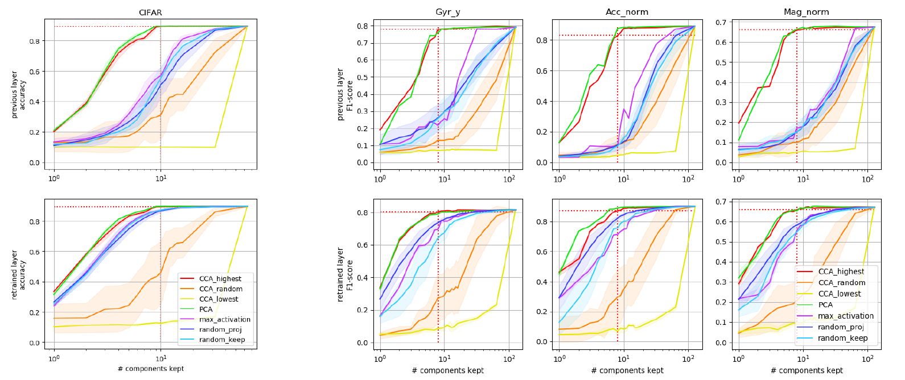
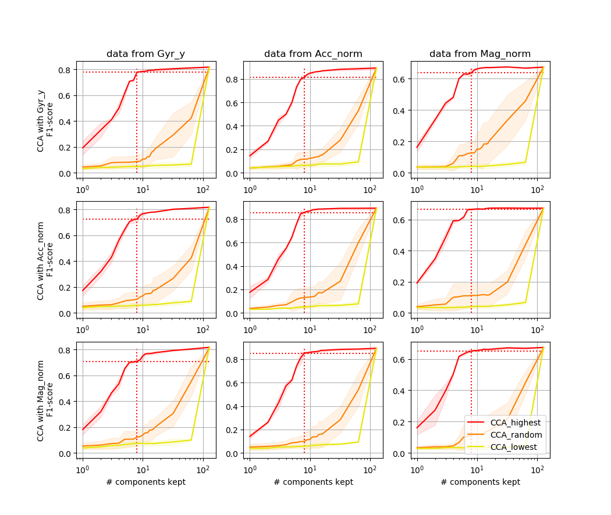

## Versions used: 
- Pytorch 1.5
- numpy  1.17
- scipy  1.3.1
- sklearn 0.23.2 (f1_score)

## Contents
The code is organized as follows:
- **models** contains the scripts to use the datasets: data preprocessing, architecture definition, training process, and feature recording. 
- **similarity** contains the main code of the publication: the projection on well-chosen subspaces \(`feature_reduction.py`\), and the measure of the performance of the projected features \(`feature_reduction.py` and `feature_reduction.py`\).  
- **svcca** contains the files from another repository that I copied here for convenience: [SVCCA](https://github.com/google/svcca/blob/master). I do not claim autorship of any of the files in this directory. We used this implementation because it computes explicit solutions \(based on inverse of covariance matrices\), which is faster than the sklearn implementation \(relying on converging sequences of canonical variables\) when we want all the components. If you are to use CCA to keep only a small number of components, prefer the [scikit-learn implementation](https://scikit-learn.org/stable/modules/generated/sklearn.cross_decomposition.CCA.html).

Most files also contain unit tests or basic displays that can be accessed by executing them directly \(as opposed to importing them\). 
Note: you will notice several similarities with the code from [another repository](https://github.com/HuguesMoreau/TMD_fusion_benchmark). In this repository, we mainly removed the possibility for a network to use multiple sensors. We also removed diverse options that were not of any use for the publication at hand and only made the code harder to understand.  

## How to use: 

### SHL 2018 dataset
- Download the official [SHL 2018 dataset](http://www.shl-dataset.org/activity-recognition-challenge/)
- Write the location of the data in your computer in 'param.py'
- Launch the script 'preprocess/reorder.py' once, from the parent directory. 'python models/SHL_2018/preprocess/reorder.py'. It will reorder the samples chronologically (which is needed for a rigorous train/val split), and store them in a compressed .pickle file (~x2 memory gain, from 20Go to 10Go, and faster loading times). At this point, the original .txt files are only needed for unit tests in 'preprocess/Datasets.py', they can be deleted to free some memory
- Launch the script 'models/store_model_SHL.py', which will train a series of networks, and record the deep features in the same directory as the SHL data is.  

### Cifar dataset
Pytorch provides all the functions to load the dataset. Execute 'models/store_model_CIFAR.py', the script will use the ResNet defined in 'models/CIFAR_ResNet.py', to train and record three couples networks with random initializations. The models and features are in the same directory as the SHL 2018 models and features.

### Projection
Simply launch 'similarity/projection_same_sensors.py' and 'similarity/projection_different_sensors.py', to obtain the figures.

## Reference
If you were to use this code for an academic publication, please cite:

H. Moreau, A. Vassilev, and L. Chen, ‘When Neural Networks Using Different Sensors Create Similar Features’, *12th EAI International Conference on Mobile Computing, Applications and Services*, November 13-14, 2021

